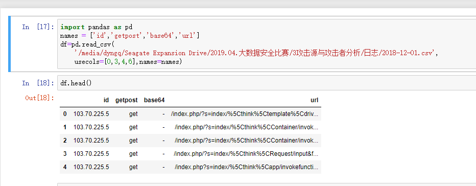
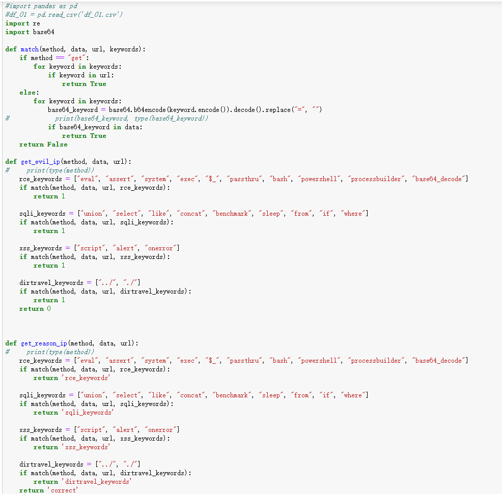

# 大数据安全比赛

> 这是第一次参加导师的介绍的比赛，也是大学最后的比赛，更是跟seaii合作的唯一的一次比赛，只做了一天，着急忙慌，但是确实上班年最好的经理和回忆。

## 过程

1. 因为实在没有时间，最后一天的时间老师让做出点东西来提交上去顺便看看其他对手的成绩。
2. 老师安排安全比较厉害的老同学帮忙，两个人一起做。
3. 我主要做一些数据分析，老同学主要做一些安全相关的函数分析。
4. 因为时间太短，没有利用机器学习算法，而是手写规则进行筛选辨析，效果相对较差。

## 方法

1. 对数据进行预处理，由于日志数据文件规模巨大，所以选择提取对于攻击分析有价值的列
2. 提取了 id列、 get或者post请求类型列、 base64加密请求信息列、 url列， 共四列数据

3. 是否为攻击的判别函数

4. 对数据的清洗汇总

## 总结

* **需要改进学习的地方太多太多，差距太大了，只有比别人努力很多很多很多才有希望追得上**
